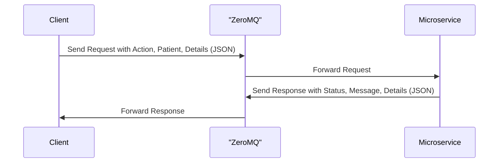

# Prescription Microservice

## Overview
This microservice allows clients to:
1. **Create a new prescription** for a patient.
2. **Retrieve prescription history** for a patient.
3. **Update an existing prescription**.

The service communicates over **ZeroMQ** using the `REQ/REP` pattern, accepting JSON-formatted requests and returning JSON-formatted responses.

---

## Communication Contract

### **How to Request Data**
To make a request, clients must:
1. Connect to the microservice using ZeroMQ on `tcp://<ip-address>:5555`.
2. Send a JSON-formatted request with the following structure:

#### JSON Request Format
```json
{
  "action": "create" | "retrieve" | "update",
  "patient": {
    "first_name": "string",
    "last_name": "string",
    "date_of_birth": "YYYY-MM-DD"
  },
  "prescription": {
    "written_drug": "string",
    "quantity": integer,
    "prescriber": "string"
  }
}
```

### **How to Receive Data**

The microservice sends responses in JSON format. The structure depends on the action specified in the request:

#### JSON Receive Format
```json
{
  "status": "success" | "error",
  "message": "string",
  "history": [
    {
      "written_drug": "string",
      "quantity": integer,
      "prescriber": "string"
    }
  ]
}
```
## UML Diagram


