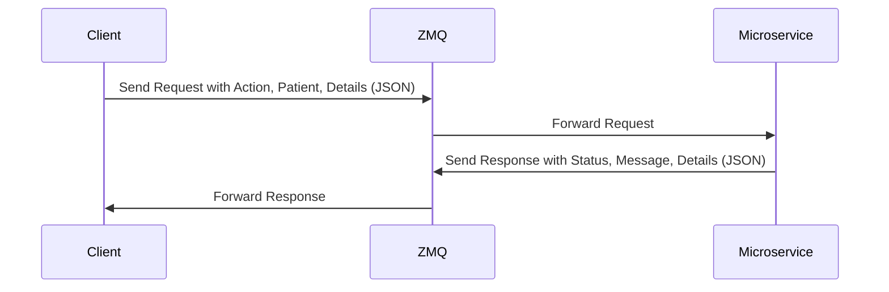

# Prescription Microservice

## Overview
This microservice allows clients to:
1. **Create a new prescription** for a patient.
2. **Retrieve prescription history** for a patient.
3. **Update an existing prescription**.

The service communicates over **ZeroMQ** using the `REQ/REP` pattern, accepting JSON-formatted requests and returning JSON-formatted responses.

---

## Communication Contract

### **How to Request Data**
To make a request, clients must:
1. Connect to the microservice using ZeroMQ on `tcp://<ip-address>:5555`.
2. Send a JSON-formatted request with the following structure:

#### Request Example
```python
import zmq

context = zmq.Context()
socket = context.socket(zmq.REQ)
socket.connect("tcp://localhost:5555")

request = {
    "action": "create",
    "patient": {
        "first_name": "John",
        "last_name": "Doe",
        "date_of_birth": "1990-01-01"
    },
    "prescription": {
        "written_drug": "Amoxicillin",
        "quantity": 30,
        "prescriber": "Dr. Smith"
    }
}

socket.send_json(request)
response = socket.recv_json()
print("Response:", response)
```

### **How to Receive Data**

The microservice sends responses in JSON format. The structure depends on the action specified in the request:

#### Receive Example
```python
import zmq
response = socket.recv_json()

if response["status"] == "success":
    print("Message:", response["message"])
    if "history" in response:
        print("Prescription History:")
        for entry in response["history"]:
            print(f"- Drug: {entry['written_drug']}, Quantity: {entry['quantity']}, Prescriber: {entry['prescriber']}")
else:
    print("Error:", response["message"])
```
## UML Diagram


